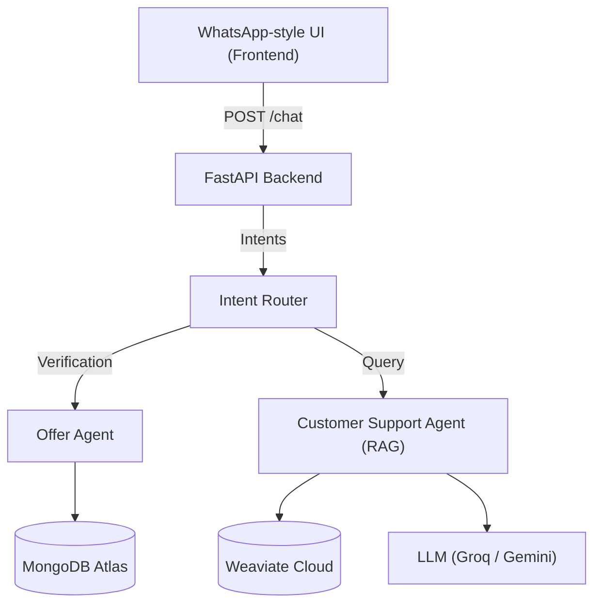

# 🍔 Swiggy WhatsApp Agent

An AI-powered backend system that simulates a **WhatsApp-style customer support agent for Swiggy-like offers**.

The agent:
- Checks customer eligibility for special offers using MongoDB
- Answers offer-related questions using **RAG (Retrieval Augmented Generation)**
- Routes user messages to the correct AI agent based on intent

🚧 **Current Status:** Fullstack Agent (Backend + Frontend) completed  
🚀 **Live Demo:** Chat UI ready for interaction

## 📌 Problem Statement

Customer support teams frequently receive repetitive queries like:
- “Am I eligible for this offer?”
- “How many orders do I need to get the offer?”
- “What are the offer terms and conditions?”

This causes:
- High load on support executives
- Slow response times

### ✅ Solution
Build an intelligent **Swiggy WhatsApp Agent** that:
- Automatically verifies customer eligibility
- Applies business rules for offers
- Uses AI to answer offer-related questions

## 🧠 System Architecture

        

## ⚙️ Backend Flow

1. Customer enters chat and provides mobile number  
2. Mobile number validated against MongoDB  
3. New customer → signup message  
4. Existing customer → order count checked  
5. Offer eligibility decided  
6. Offer questions answered using RAG

## 🧩 Agents Overview

### Offer Agent
- Validates customer
- Counts orders
- Determines eligibility

### Customer Support Agent (RAG)
- Answers offer-related questions
- Uses Offer PDF + Weaviate + LLM

### Intent Router
- Mobile number → Offer Agent
- Text query → Customer Support Agent

---

## � Frontend Features

The project now includes a modern, responsive **WhatsApp-style Chat UI** built with vanilla web technologies.

- **Theme Toggle:** Switch between Light and Dark modes.
- **View Modes:** Toggle between Desktop and Mobile phone mockups.
- **Real-time Chat:** Seamless communication with the FastAPI backend.
- **Responsive Design:** Optimized for various screen sizes.

## �🗄️ Database Design

Customers:
{
  "mobile": "9876543210",
  "name": "Harini"
}

Orders:
{
  "mobile": "9876543210",
  "order_id": "ORD123"
}

## 📄 RAG Data Source

OfferData/swiggy_customer_offers_rag_training.pdf

## 🛠️ Tech Stack

Backend:
- Python, FastAPI
- LangChain
- MongoDB Atlas
- Weaviate Cloud
- Groq / Gemini

Frontend:
- HTML5, CSS3 (Vanilla)
- JavaScript (Fetch API)
- FontAwesome Icons

### 🏃‍♂️ Running the Backend
1. Create virtual environment
2. Install requirements
3. Set environment variables
4. Embed offer PDF
5. Run FastAPI server: `uvicorn main:app --reload`

### 🎨 Running the Frontend
1. Navigate to the `Frontend` folder.
2. Open `index.html` in your browser.
3. Ensure the backend is running at `http://127.0.0.1:8000`.

## 🎯 Future Enhancements

- Real WhatsApp Business API integration
- Chat history persistence
- Analytics dashboard for offer performance
- Admin portal for offer management

## 👩‍💻 Author

Harini H
